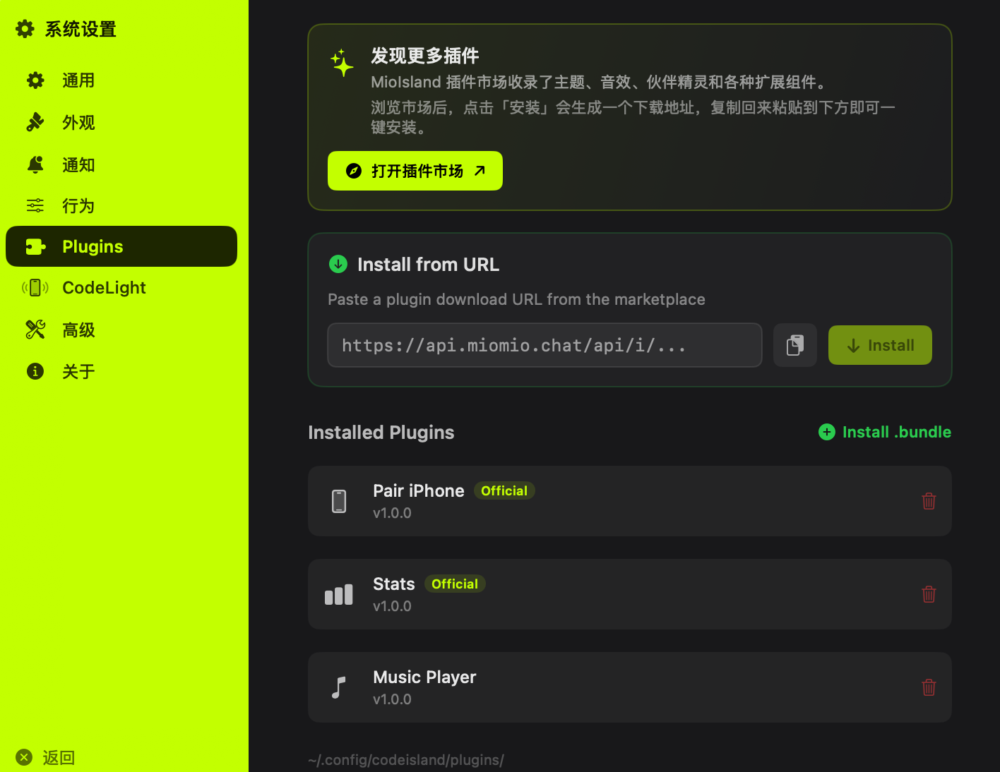

<div align="center">


# 喵喵岛 MioIsland

### 把 AI 编程助手放进 MacBook 刘海里。

一只像素猫，帮你盯着所有 Claude Code 会话。
思考、跑工具、等审批、出错 —— 你不用切窗口就知道。

[English](README.md) | 中文

[](https://github.com/MioMioOS/MioIsland/stargazers)
[](https://github.com/MioMioOS/MioIsland/releases)
[](https://github.com/MioMioOS/MioIsland/releases)
[](LICENSE.md)

**免费开源，没有商业目的。觉得好用请点个 Star。**

<a href="https://github.com/MioMioOS/MioIsland/releases"></a>

</div>

---

<div align="center">


*刘海收起时：像素猫 + 状态颜色 + 活跃会话数。一直在视野里，又不遮挡。*

</div>

## 它能做什么

<table>
<tr>
<td width="33%"></td>
<td width="33%"></td>
<td width="33%"></td>
</tr>
</table>

### 一眼看全局

刘海里的像素猫会用**颜色**告诉你 Claude 在干什么：紫色思考中、青色跑工具、琥珀色等审批、绿色干完了、红色出错了。展开就能看到所有会话列表，点一下跳到对应终端。

### 直接审批权限

Claude 想写文件、跑命令？不用切终端 —— 刘海里直接弹出代码差异预览，一键允许或拒绝。

### Claude 问你问题？刘海里直接回答

AskUserQuestion 的选项以可点击的芯片按钮显示在会话行里，点一下就发送答案。支持多选和自定义输入。

### 支持 Codex

不只是 Claude Code —— Codex 会话同样自动检测、追踪、显示在列表中。

### 自定义你的刘海

主题色、字体大小、宽度、位置 —— 全部可调。Live Edit 模式实时预览，改到满意再保存。

### 和你的 Claude 宠物互动

完整对接 `/buddy` 系统。18 种物种、5 项属性、稀有度星级，全部用 ASCII 像素画渲染在刘海里。

### 8-bit 音效

每种事件有专属芯片音效。开始、完成、审批、出错 —— 闭着眼也知道发生了什么。每个声音可单独开关。

---

## 手机遥控：Code Light

<div align="center">

[](https://apps.apple.com/us/app/code-light/id6761744871)

</div>

搭配 iPhone 应用 **[Code Light](https://github.com/MioMioOS/CodeLight)**，走到哪都能看 Claude 在干什么：

- **灵动岛实时显示** Claude 当前阶段
- **发消息、发斜杠命令**，精准送达指定终端
- **手机上新建会话**，Mac 自动启动 Claude
- **推送通知** —— 任务完成、需要审批、出错，第一时间知道
- 永久 6 位配对码，扫码或输码秒连

> 中国大陆暂不可用（ICP 备案中），其他 147 个国家/地区已上架。

---

## 🪄 插件市场

MioIsland 现在自带**插件系统**，配套的插件市场托管在 **[miomio.chat](https://miomio.chat/plugins)**，你可以浏览和安装第三方插件 —— 主题、氛围音效、伙伴精灵、实用扩展（比如自带的 Stats 和 Music Player）。

<div align="center">
  
</div>

**如何安装**：

1. 打开 MioIsland **系统设置 → Plugins**
2. 访问 [miomio.chat/plugins](https://miomio.chat/plugins) 选一个插件，点「安装」
3. 复制生成的下载地址，粘贴到插件页顶部的 **Install from URL** 输入框
4. 点「Install」—— MioIsland 会自动下载、校验、加载

官方插件（Pair iPhone、Stats）即使删除了仍会保留在列表里，一键重装即可。所有上架插件都经过人工审核后才会向用户开放。

如果你是开发者，可以前往 [开发者中心](https://miomio.chat/developer) 提交自己的插件。源代码会镜像到内部 Gitea 用于安全审核，通过后即向所有用户发布。

---

## 支持的终端

| 终端 | 跳转 | 快捷回复 |
|------|------|---------|
| **cmux** | workspace 精确跳转 | ✅ |
| **iTerm2** | AppleScript | ✅ |
| **Ghostty** | AppleScript | - |
| **Terminal.app** | 激活 | ✅ |
| Warp / VS Code / Cursor / Zed / Kitty / WezTerm / Alacritty | 激活 | - |

> 推荐搭配 **[cmux](https://cmux.com)** —— 精确跳转 + 快捷回复 + 智能抑制，多会话管理的最佳拍档。

---

## 安装

### Homebrew（推荐）

```bash
brew install xmqywx/codeisland/codeisland
```

cask 会自动处理 Gatekeeper,装完直接双击打开即可。

### 手动下载

从 [Releases](https://github.com/MioMioOS/MioIsland/releases) 下载最新 `.zip` → 解压 → 拖到「应用程序」。

MioIsland 为**未签名**构建,macOS Gatekeeper 会拦截首次打开。二选一:

- **右键** `Mio Island.app` → **打开** → 再点**打开**,或者
- 终端运行一次: `xattr -dr com.apple.quarantine "/Applications/Mio Island.app"`

之后双击直接开。

系统要求:macOS 15+,带刘海的 MacBook。

### HTTP 代理(国内网络受限环境)

`设置 → 通用 → Anthropic API Proxy` 可以让 Mio Island 对 Anthropic API 的请求都走你本地的 HTTP 代理(比如 `http://127.0.0.1:7890`)。在本地跑 Clash / V2Ray 的开发者,直连不稳时用得上。

**这个设置**会被应用到:
- ✅ 刘海里的额度条(`RateLimitMonitor` → `api.anthropic.com/api/oauth/usage`)
- ✅ **MioIsland 启动的所有子进程** —— 包括 Stats 插件的 `claude` CLI、未来任何插件的 shell-out。Mio Island 在启动时给自己的进程 `setenv` 一次 `HTTPS_PROXY` / `HTTP_PROXY` / `ALL_PROXY`,所有子进程自动继承,不需要每个插件单独适配
- ❌ **不**作用于 CodeLight iPhone 同步(我们自己的服务器 `island.wdao.chat`,直连最快,走代理反而增加延迟和故障点)
- ❌ **不**作用于第三方插件自己用 `URLSession` 调用外部 API —— 那种走系统偏好设置(系统设置 → 网络 → 代理),不读这里的值

**不需要**跑 `launchctl setenv HTTPS_PROXY ...` —— 在 Settings 里填上就够了,作用范围精准只覆盖 MioIsland 自己。不填就是直连。

<details>
<summary><b>从源码构建</b></summary>

```bash
git clone https://github.com/MioMioOS/MioIsland.git
cd MioIsland
xcodebuild -project ClaudeIsland.xcodeproj -scheme ClaudeIsland \
  -configuration Release CODE_SIGN_IDENTITY="-" \
  CODE_SIGNING_REQUIRED=NO CODE_SIGNING_ALLOWED=NO \
  DEVELOPMENT_TEAM="" build
```

</details>

---

## 工作原理

1. 首次启动自动安装 Claude Code hooks
2. Claude 的每个状态变化通过 Unix socket 送到喵喵岛
3. 权限请求保持 socket 打开，等你在刘海里点允许/拒绝后再回传
4. 终端跳转通过 AppleScript 匹配工作目录实现

不收集任何数据。不联网（除了 iPhone 同步功能）。不需要账号。

---

## 相关项目

| 项目 | 说明 |
|------|------|
| [Code Light](https://github.com/MioMioOS/CodeLight) | iPhone 伴侣应用 |
| [MioServer](https://github.com/MioMioOS/MioServer) | 自托管中继服务器 |
| [cmux](https://cmux.com) | 推荐的终端复用器 |

---

## 参与贡献

- [提 Bug](https://github.com/MioMioOS/MioIsland/issues) · [提 PR](https://github.com/MioMioOS/MioIsland/pulls) · [建议功能](https://github.com/MioMioOS/MioIsland/issues)

每个 PR 我都会亲自 review。

## 联系

- **邮箱** xmqywx@gmail.com

    

---

<div align="center">

基于 [Claude Island](https://github.com/farouqaldori/claude-island) 改造。

[](https://star-history.com/#MioMioOS/MioIsland&Date)

**CC BY-NC 4.0** — 个人免费，禁止商用。

</div>
